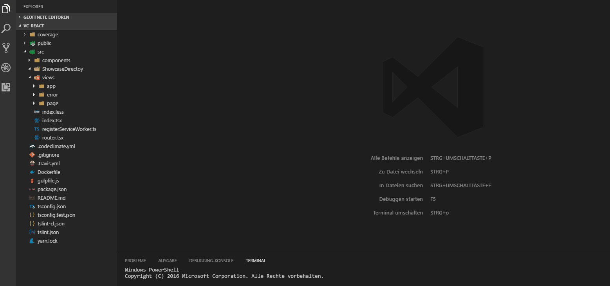

# react-typescript-toolbox


Extension to create TypeScript React Components from Visual Studio Code explorer menu.

## Features

Create React Components, Typescript Enums, Model Classes (or just ordinary classes), and index files by rightclicking in the context menu of the file explorer and generate it. The files are created with index export files, and the export will be appended to the root index, if it is present.



> Tip: Rightclick in Visual Studio Code Explorer and > Generate Component.

> Tip: Use the settings.json to disable test generation or changing the stylesheet type.

### Root Index Sort

If this feature is activated, your root index exports will be sorted if you have a structure like this:

```typescript
// Models
export a from "./a"
export d from "./c"

// Components
export b from "./b"

// Utils
export c from "./c"
```

The comments represent layers, the extension will not sort between Components and Models exports for example. There is a selection menu after creating a file, so you can select to which layer the new export is appended. 

## Requirements

This extension has no dependencies to other extensions. Maybe node.js installed ist required!

## Extension Settings

Available Settings:

* `reactTypeScriptToolbox.stylesheet`: `('none' | 'less' | 'css' | 'sass')`
* `reactTypeScriptToolbox.test`: `(true | false)`
* `reactTypeScriptToolbox.regexCheck`: `(true | false)`
* `reactTypeScriptToolbox.indentation`: `(tabs | spaces)`
* `reactTypeScriptToolbox.sortIndex`: `(true | false)`
* `reactTypeScriptToolbox.testFolder`: `(same | flat | structured)`
* `reactTypeScriptToolbox.removeSemicolonsFromImportsOnSave (still experimental)`: `(true | false)`

## Known Issues

## [Changelog](https://github.com/Sly321/react-typescript-toolbox/blob/master/CHANGELOG.md)

-----------------------------------------------------------------------

### For more information

* [Github](https://github.com/Sly321/react-typescript-toolbox)
* Any ideas? Mail me: liebigs@gmail.com